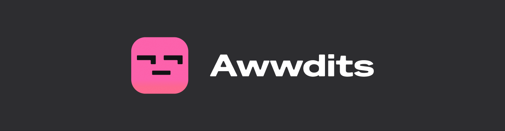
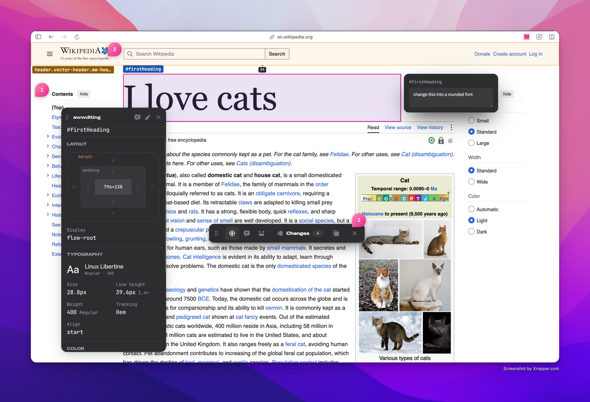
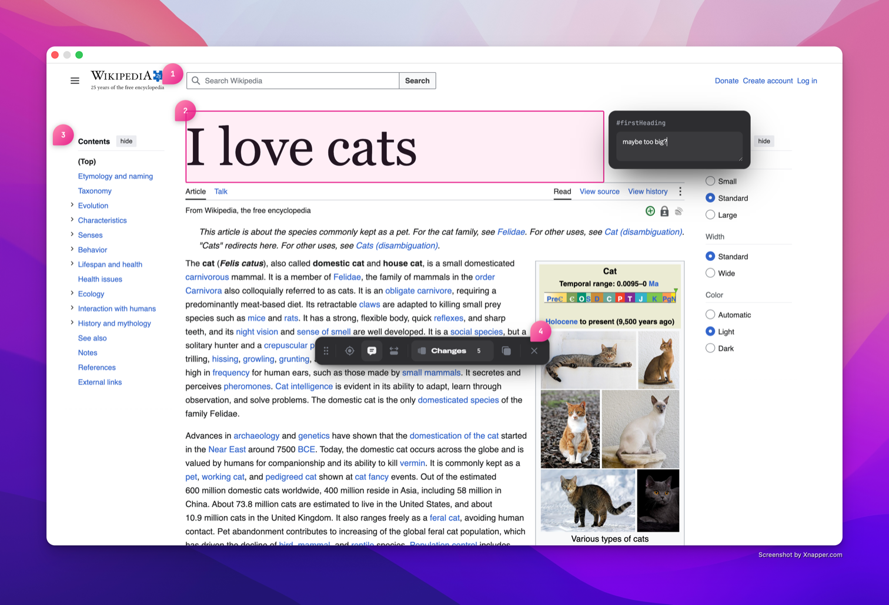
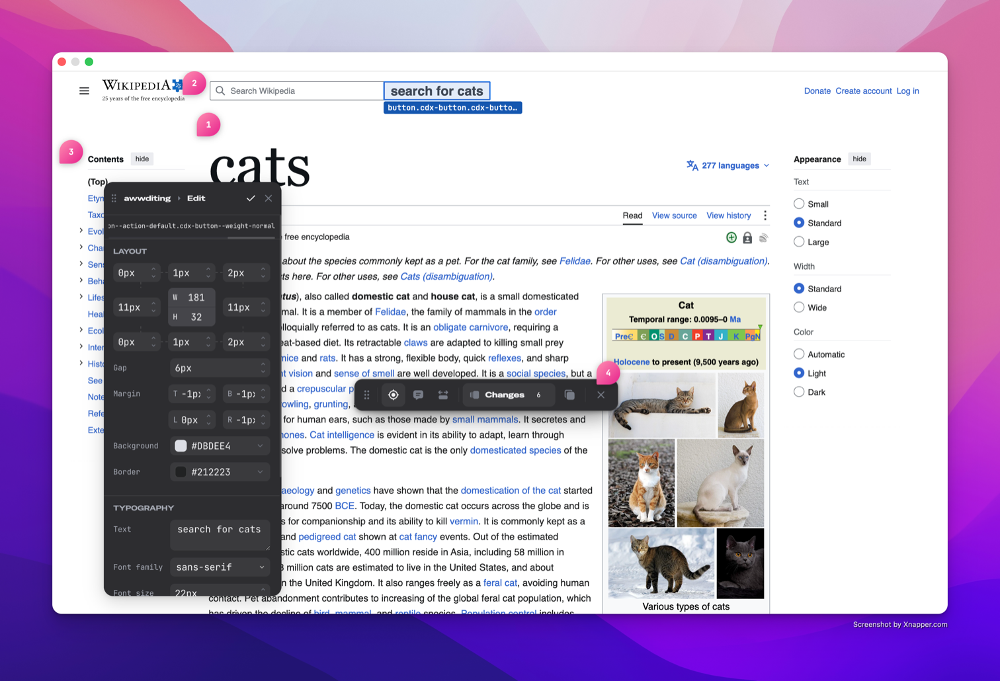
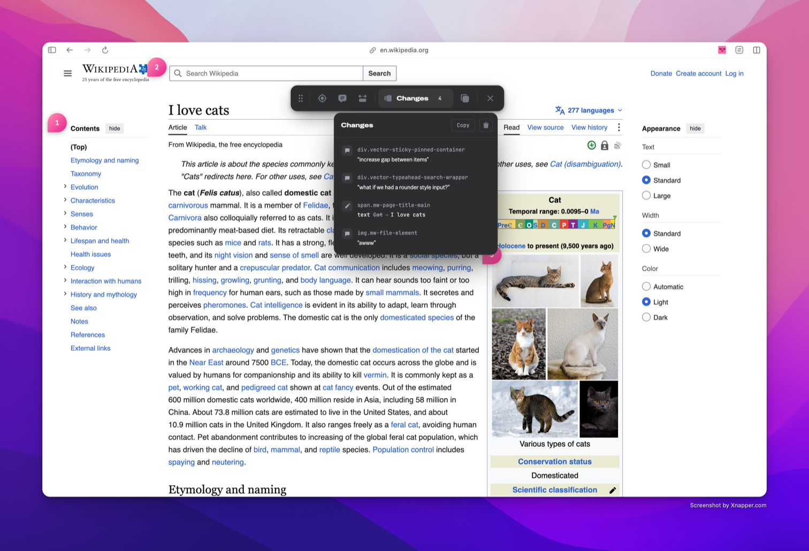

Review any live page: comment on elements, tweak the CSS, and hand the whole thing to a
developer or an LLM as structured text.



"The padding is off here" is not actionable. Awwdits turns review into what a developer or
a coding agent can use directly: which element, what is wrong, and the exact CSS change.

## Install

Not on the Chrome Web Store yet, so build it:

```bash
git clone https://github.com/overlyhonest/awwdits.git
cd awwdits
npm install
npm run build
```

Then open `chrome://extensions`, turn on Developer mode, choose "Load unpacked", and
select `dist/`.

## How it works

Open with `Alt+Shift+A`. Hold `Cmd` (or `Ctrl`) and click an element to inspect it, or add
`Shift` to comment on it.



Tweak the CSS and every change is tracked as a before and after pair. Comments and changes
persist per page URL.



Hold `X` and click two elements to measure the gap between them. Awwdits draws both
elements' dimensions and the distance between them, the way Chrome's inspector does. A
third click starts over.

Select an image, either an `` or a CSS background, and the panel adds its dimensions,
its file size where the host allows reading it, and a one-click Download Asset.

## What you hand off

Copy from the changes popover:

```
## h3.pricing-card__title
Comment: "This is competing with the price for attention"
Changes:
  - font-size: 24px → 18px
  - font-weight: 700 → 500
  - color: #FFFFFF → #A1A1AA

## a.pricing-card__cta
Comment: "Needs more room to breathe"
Changes:
  - padding: 8px 16px → 12px 24px
```

Paste that into a ticket, a PR, or an LLM. Selectors are class-based on purpose: awwdits
knows each element's positional path but leaves it out, since positional paths break the
moment a sibling moves.



## Shortcuts

| Shortcut | Does |
|---|---|
| `Alt+Shift+A` | Toggle Awwdits |
| `Cmd` / `Ctrl` + click | Inspect |
| `Cmd` / `Ctrl` + `Shift` + click | Comment |
| Hold `X` | Measure |
| `Escape` | Deselect |

Modifiers are momentary: the tool is live only while the key is down. Clicking a toolbar
tool makes it sticky instead.

## Development

```bash
npm run dev        # rebuild on save
npm test           # run the test suite
npm run storybook  # component workbench
```

Reload the extension after a rebuild to pick up content script or service worker changes.

See [`CONTRIBUTING.md`](CONTRIBUTING.md) to get started and [`DESIGN_SYSTEM.md`](DESIGN_SYSTEM.md)
for the token rules. Specs and implementation plans live in
[`docs/superpowers/`](docs/superpowers/) and explain the reasoning behind the toolbar model.

## License

GPL v3. See [`COPYING`](COPYING).

This is copyleft on purpose: use it, fork it, sell it, but if you distribute a modified
version it has to stay open too.
